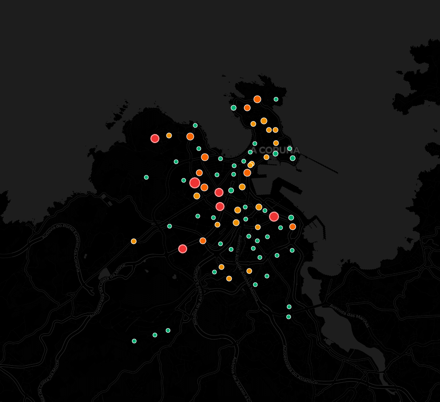

# 📊 A Coruña Bike Sharing Analysis

> **Technical Report** derived from 8 days of high-frequency tracking data (27 Jan - 03 Feb 2026).

## 1. System Dynamics

The system comprises **78 stations** with a very standard capacity design:
- **Size Mode:** 19 docks (33 stations, ~42% of network)
- **Secondary Standard:** 15 docks (22 stations, ~28% of network)
- **Extremes:** Ranging from 13 docks (Plaza de Conchiñas) to 29 docks (Plaza de Pontevedra).

### "Ghost Stations" vs "Hotspots"
Using `mode(bikes_available)` analysis, we identified critical chronic states:

- **Chronic Shortage (Mode ≈ 0):** Users rarely find bikes here.
  - *Agra do Orzán, Marineda, San Rosendo, Santa Margarita.*
- **Chronic Saturation (Mode ≈ Capacity):** Users rarely find parking.
  - *Plaza Indalecio Prieto (87% occupancy typical).*
  - *Novo Mesoiro (65% occupancy typical).*

### Spatial Risk Distribution
The following map visualizes the percentage of time each station remains at zero stock (Strict Stockout Risk).

## 2. Mobility Flows (Inferred by AI)

Using temporal inverse correlation analysis (`-0.15` threshold), we detected organic movement patterns without GPS data:

1. **The "Commuter" Pulse:** Strong morning flow from residential areas (e.g., *Agra do Orzán, Os Mallos*) towards city center / business districts (*Plaza de Vigo, Obelisco*).
2. **The "Leisure" Pulse:** Weekend flows towards coastal areas (*Torre de Hércules, Aquarium*).

## 3. Station Clustering (Unsupervised Learning)

To group stations by usage behavior, we applied **K-Means Clustering** on normalized hourly occupancy profiles.

### Determination of K (Elbow Method)
We analyzed inertia reduction from K=2 to K=10:
*   K=2 → K=3: **-17.8% inertia** (Greatest drop, but K=2 oversimplifies complex dynamics)
*   K=3 → K=4: **-13.6% inertia** (Significant gain for nuanced clustering)
*   K=4 → K=5: **-11.4% inertia** (Diminishing return starts)

**Decision:** We selected **K=4** as the optimal balance for visualization interpretability without over-segmenting the network.

### Identified Patterns (Archetypes)
*Note: Cluster IDs are consistent (random_state=42).*

1.  **Cluster 0 (Cyan - "Morning Destination"):** 15 stations (e.g., *Cantones, Casa del Agua*). peak occupancy at **08:00 AM**. Critical commuter sinks.
2.  **Cluster 1 (Magenta - "Afternoon Hubs"):** 14 stations (e.g., *Pablo Picasso, Barrio Flores*). Peak occupancy at **15:00 PM**.
3.  **Cluster 2 (Yellow - "Evening Active"):** 10 stations (e.g., *Monte Alto, Adormideras*). Lowest availability at **18:00 PM**.
4.  **Cluster 3 (Violet - "Main Residential"):** 39 stations (Majority). Empties steadily until **10:00 AM** (e.g., *Agra do Orzán*). Primary source of morning commutes.

## 4. Predictive Modeling Findings

We conducted A/B testing on system definitions to optimize operations.

### Finding A: The "Empty" Definition
Operational risk is better defined by a safety buffer than by literal emptiness.
- **Hypothesis:** Predict strictly 0 bikes. -> **Impact:** High false negatives, late alerts.
- **Solution:** Predict < 5 bikes. -> **Impact:** F1-Score increased to **78.3%**.

### Finding B: Local vs Transfer Learning
- **Hypothesis:** Pre-training on Barcelona (500k+ rows) would boost performance on Coruña (small dataset).
- **Reality:** A surprisingly specific local behavior logic rendered the transfer learning ineffective (no gain).
- **Conclusion:** A Coruña's mobility patterns are distinct enough to require dedicated local models.

## 4. Recommendations for Operators

1. **Rebalancing Strategy:** Prioritize restocking *Agra do Orzán* and *Marineda* before 08:00 AM, as they deplete instantly.
2. **Expansion:** *Plaza Indalecio Prieto* urgently needs capacity expansion (currently 15 docks, constantly full).
3. **Alert System:** Set operational alerts at **5 bikes** (not 0) to allow 20-30 min reaction time for logistics teams.
