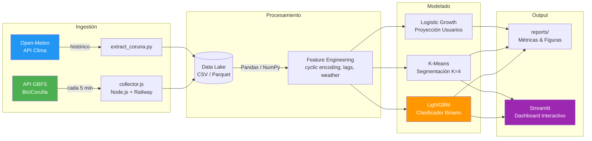

<div align="center">


</div>


# BiciCoruña: Análisis Predictivo de Disponibilidad en Sistemas de Bicicleta Compartida

> **Ingeniería de datos aplicada a sistemas de bicicleta compartida.**  
> Un estudio completo "End-to-End" que transforma datos crudos en decisiones de negocio: desde la ingestión en tiempo real (ETL) hasta la **predicción de roturas de stock** (LightGBM) y el diseño de **estrategias de rebalanceo** basadas en clustering y análisis de riesgo operativo.

---

## Tabla de Contenidos
1. [Resumen Ejecutivo](#1-resumen-ejecutivo)
2. [Arquitectura del Proyecto](#2-arquitectura-del-proyecto)
3. [Metodología y Experimentación](#3-metodología-y-experimentación)
4. [Resultados y Métricas](#4-resultados-y-métricas)
5. [Análisis Visual e Insights Operativos](#5-análisis-visual-e-insights-operativos)
6. [Insights de Negocio y Métricas Operativas](#6-insights-de-negocio-y-métricas-operativas)
7. [Impacto de Negocio & ROI](#7-impacto-de-negocio--roi)
8. [Conclusiones del Estudio](#8-conclusiones-del-estudio)
9. [Stack Tecnológico](#9-stack-tecnológico)
10. [Fuentes de Datos](#10-fuentes-de-datos)
11. [Cómo Reproducir en 3 Pasos](#11-cómo-reproducir-en-3-pasos-tiempo-estimado--10-min)
12. [Roadmap](#12-roadmap-próximos-pasos)
13. [Licencia](#13-licencia)
14. [Autor](#14-autor)

---

## 1. Resumen Ejecutivo

Este proyecto aborda el desafío de **gestionar la disponibilidad** en una red de **79 estaciones** y **670 bicicletas** ([Fuente: Concello da Coruña](https://www.coruna.gal/bicicoruna/gl)). A diferencia de proyectos basados en datasets públicos preexistentes, **el dataset principal fue construido desde cero**: se diseñó y desplegó un scraper propio (`collector.js`) que monitoriza la API GBFS en tiempo real cada 5 minutos, consolidando miles de snapshots en una serie temporal histórica que no existía públicamente. Mediante el análisis de estos datos, se han logrado los siguientes hitos:

*   **Identificación de Patrones (K=4):** Segmentación matemática de estaciones en 4 arquetipos funcionales (Residencial, Laboral, Ocio, Híbrido) validada mediante el método del codo.
*   **Modelo Predictivo Efectivo:** Desarrollo de un clasificador **LightGBM** capaz de predecir la disponibilidad en un horizonte de **30 minutos** con un **F1-Score de 0.78** y **Accuracy del 87%**.
*   **Optimización de Umbrales:** Redefinición del concepto de "estación vacía" (de 0 a <5 bicis) para mejorar la sensibilidad operativa y evitar roturas de stock.

---

## 2. Arquitectura del Proyecto

El sistema sigue un pipeline de datos modular y reproducible, desde la ingestión hasta la visualización:



### 2.1 Características Clave
| Capa | Componente | Descripción |
|------|-----------|-------------|
| **Ingestión** | `collector.js` | Scraper Node.js desplegado en Railway, tolerante a fallos y gaps de datos. Captura cada 5 min. |
| **Config** | `config.yaml` | Configuración centralizada: umbrales, rutas, hiperparámetros. Un solo punto de verdad. |
| **Feature Eng.** | `prepare_data.py` | Codificación cíclica (hora, día), lags temporales, features meteorológicas y de tendencia. |
| **Modelado** | `classifier_final.py` | Transfer Learning (Barcelona → Coruña) + Fine-Tuning con early stopping. |
| **Evaluación** | `src/evaluation/` | Análisis de negocio: ROI, riesgo operativo, optimización de flota, proyección de usuarios. |
| **Dashboard** | `app.py` + HTML | Streamlit + Leaflet.js con estética dark mode para monitorización geoespacial. |

### 2.2 Estructura del Repositorio
<details>
<summary><strong>Ver Árbol de Directorios Completo</strong></summary>

```text
bicicoruna-fleet-optimization/
├── assets/                  # Recursos estáticos (GIFs, imágenes)
├── collector.js             # ETL: Scraper de datos en tiempo real (Node.js)
├── config.yaml              # Configuración global del proyecto
├── package.json             # Dependencias Node.js del colector
│
├── data/
│   ├── README.md            # Documentación de datos y reproducibilidad
│   ├── coruna/              # Datos crudos de telemetría BiciCoruña
│   ├── external/            # Datos auxiliares (GeoJSON, demografía)
│   └── processed/           # Insights ligeros y resultados clave
│
├── src/
│   ├── preprocessing/       # Limpieza y Feature Engineering
│   ├── models/              # Entrenamiento LightGBM y comparativas
│   ├── evaluation/          # Métricas de negocio, ROI y clustering
│   ├── visualization/       # Mapas interactivos y gráficos
│   └── utils/               # Config loader y time-based split
│
├── models/                  # Modelo de producción (classifier_final.txt)
├── dashboard/               # App Streamlit + mapas HTML (Leaflet)
├── reports/
│   ├── figures/             # Gráficos generados (PNG)
│   └── resumen_analisis.txt # Resumen ejecutivo del análisis
│
├── ANALYSIS_REPORT.md       # Reporte técnico detallado
├── MODEL_CARD.md            # Model Card (ML responsable)
├── SETUP.md                 # Guía de despliegue del colector
├── requirements.txt         # Dependencias Python
├── LICENSE                  # MIT License
└── README.md                # Documentación principal
```
</details>

> **Nota:** El dataset principal de telemetría está incluido en el repositorio ([`data/coruna/tracking_data.csv`](data/coruna/tracking_data.csv)). Consulta [`data/README.md`](data/README.md) para más detalles.

---

## 3. Metodología y Experimentación

Se aplicó un enfoque científico riguroso para validar hipótesis:

### 3.1 Optimización del Umbral de Escasez (Threshold Tuning)
Un desafío crítico fue definir operativamente qué es una "estación vacía".
*   **Diseño Experimental:** Se evaluaron iterativamente múltiples umbrales de disponibilidad (de 0 a 10 bicicletas) como variable objetivo.
*   **Trade-off Analizado:**
    *   *Umbral bajo (0-2):* Alta precisión pero bajo recall (muchos falsos negativos, alertas tardías).
    *   *Umbral alto (>7):* Alto recall pero baja precisión (demasiadas falsas alarmas).
*   **Punto Óptimo:** El umbral de **< 5 bicicletas** maximizó el F1-Score global, proporcionando el equilibrio perfecto entre sensibilidad y tiempo de reacción logística (aprox. 30 min antes del agotamiento total).

### 3.2 Transfer Learning (Validación Experimental)
*   **Hipótesis:** ¿Mejora el modelo si pre-entrenamos con 500k registros de Bicing (Barcelona)?
*   **Resultado:** El modelo nativo de Coruña (**F1 0.783**) superó ligeramente al pre-entrenado (**F1 0.782**).
    *   *Conclusión:* El Transfer Learning introdujo sesgos topográficos negativos (ciudad plana vs ciudad con cuestas).
    *   *Valor:* Se descartó la complejidad arquitectónica en favor de un modelo local ligero y eficiente.
    
    *(Nota: Los scripts y datasets de este experimento comparativo se han archivado para mantener la ligereza del repositorio final).*

---

## 4. Resultados y Métricas

A continuación se detallan los resultados cuantitativos obtenidos tras las fases de experimentación y validación cruzada.

### 4.1 Comparativa de Umbrales Operativos (Threshold Tuning Results)
Se evaluó el impacto del umbral de alerta en la calidad de la predicción y su utilidad:

| Umbral Evaluado (< N Bicis) | Precision | Recall | F1-Score | Impacto Operativo |
| :--- | :---: | :---: | :---: | :--- |
| **Estricto (0)** | **0.95** | 0.30 | 0.45 | **Negativo:** Alertas cuando ya no hay bicis. |
| **Intermedio (2)** | 0.88 | 0.47 | 0.61 | **Bajo:** Poco margen de maniobra. |
| **Óptimo (5)** | 0.82 | **0.75** | **0.78** | **Positivo:** Equilibrio ideal (30 min reacción). |
| **Laxo (8)** | 0.60 | 0.85 | 0.70 | **Negativo:** Exceso de falsas alarmas (ruido). |

### 4.2 Evaluación de Modelos
| Modelo | Estrategia de Entrenamiento | F1-Score | Observaciones |
| :--- | :--- | :---: | :--- |
| **Baseline** | Heurística de media histórica | 0.42 | No captura picos de demanda. |
| **Transfer Learning** | Pre-entrenado Barcelona | 0.78 | Sin mejora significativa (Sesgo geográfico). |
| **Local Model** | **LightGBM Nativo (Coruña)** | **0.78** | **Máximo rendimiento; captura el "pulso" local.** |

<details>
<summary><strong>Ver Hiperparámetros del Modelo (LightGBM)</strong></summary>

Configuración final utilizada para el modelo `LGBMClassifier`:
```json
{
    "objective": "binary",
    "metric": "binary_logloss",
    "boosting_type": "gbdt",
    "num_leaves": 31,
    "max_depth": 6,
    "learning_rate": 0.05,
    "feature_fraction": 0.8,
    "n_jobs": -1,
    "seed": 42,
    "is_unbalance": true
}
```
</details>


---

## 5. Análisis Visual e Insights Operativos

Transformamos datos crudos en inteligencia accionable para la toma de decisiones.

### 5.1 Segmentación de Estaciones (Clustering K-Means)
Utilizamos aprendizaje no supervisado para agrupar estaciones por comportamiento horario.

**5.1.1 Determinación de K (Método del Codo):**
Validación matemática del número óptimo de clusters. La inercia se estabiliza significativamente en **K=4**.


**5.1.2 Perfiles Horarios Resultantes:**
Identificamos claramente la "marea pendular" de la ciudad:
*   **Línea Violeta (Residencial):** Se vacía drásticamente a las 08:00 AM (origen de viajes, la gente sale a trabajar).
*   **Línea Cyan (Destino/Trabajo):** Se llena recíprocamente a la misma hora (llegada masiva a oficinas/campus).


### 5.2 Ciclos Temporales (Heatmap Semanal)
Análisis de densidad temporal que revela los hábitos de la ciudad.


### 5.3 Impacto Meteorológico (Factores Exógenos)
Correlacionamos los datos de uso con variables climáticas locales (`src/evaluation/analisis_clima.py`):
*   **Lluvia:** Una precipitación > 0.1mm reduce la demanda en un **-22.2%**.
*   **Viento:** Sorprendentemente, rachas > 20km/h no redujeron el uso (+6%), sugiriendo la resiliencia del usuario de e-bike.
*   **Temperatura:** Correlación positiva moderada (**r=0.20**); cada grado cuenta.

---

## 6. Insights de Negocio y Métricas Operativas

Análisis de KPIs clave para evaluar el rendimiento del sistema y su impacto social:

### 6.1 Impacto Ambiental ([Datos Oficiales 2025](https://www.coruna.gal/bicicoruna/gl))
Basado en estadísticas del servicio: **16.462 usuarios activos**, **1.728.835 usos en 2025**, **5.124.239 km recorridos**.
> **76.2 Toneladas de CO2 ahorradas al mes.**
> 
> *   **Equivalencia Local:** Este ahorro equivale a eliminar **4.320 trayectos diarios** de coches por la Avenida Alfonso Molina (el 7.8% de su tráfico medio).
> *   **Impacto Visual:** Equivale a retirar de la circulación una caravana ininterrumpida de **200 coches** (casi 1 km de atasco) cada mes.
> *Dato validado con el récord histórico de 2025 (1.7M usos). Fuente: [Estadísticas BiciCoruña - Concello da Coruña](https://www.coruna.gal/bicicoruna/gl).*

### 6.2 Resiliencia del Sistema (Service Level)
A pesar de los cuellos de botella detectados, la resiliencia de la red es alta:
*   **Disponibilidad Global:** **97.2%** (El usuario encuentra bici el 97% de las veces).
*   **Concentración del Fallo:** El **2.8%** de indisponibilidad se concentra en 5 nodos críticos, validando una estrategia de rebalanceo focalizada (Principio de Pareto).

### 6.3 Dinámica de Flujos Pendulares
La red exhibe un comportamiento biológico cíclico:
*   **Flujo Centrípeto (07:00 - 09:00):** Movimiento masivo desde áreas residenciales hacia zonas laborales y universitarias.
*   **Flujo Centrífugo (14:00 - 16:00):** Dispersión de retorno hacia la periferia.


> *Visualización interactiva disponible en `dashboard/timelapse_premium.html`.*

### 6.4 Predicción de Futuro: Saturación y Expansión
Hemos modelado el futuro del sistema basándonos en datos históricos y algoritmos de optimización.

**Proyección de Capacidad (Saturación 2026):**
El modelo logístico predice que, con la red actual, **BiciCoruña tocará techo en ~17.000 usuarios**. El crecimiento explosivo post-electrificación se ha frenado, entrando en una fase de meseta.


---

## 7. Impacto de Negocio & ROI
Transformamos las predicciones en euros y decisiones estratégicas (`src/evaluation/impacto_negocio.py`):

### 7.1 Cuantificación del Riesgo (Datos Calibrados Ene'26)
*Calibrado con stats oficiales (145.028 usos/mes en 79 estaciones = ~3.4 usos/hora/estación).*

El sistema pierde **721 horas de servicio** a la semana por falta crítica de bicicletas (Stockouts operacionales < 2 uds).
*   **Coste Estimado (Churn Risk):** Asumiendo un riesgo de baja conservador (2%) y tarifa anual (40€):
    > **102.000€ Anuales en Riesgo de Retención de Usuarios.**
    *(Equivalente al ~15% de la facturación estimada)*.

### 7.2 Scorecard de Riesgo por Arquetipo
El riesgo no se distribuye equitativamente. Los barrios residenciales asumen la mayor parte del fallo de servicio:


*   **Insight:** El Cluster 1 (Hubs de Tarde, barra rosa) es el más estable (~3% fallo). Por contra, los puntos extremos del viaje sufren más: el **Cluster 3 (Residencial, barra violeta)** colapsa por vaciado matutino y el **Cluster 0 (Destino, barra azul)** por ineficiencia de retorno, sumando un riesgo operativo del ~8-9%.

### 7.3 Mapa de Riesgo Operativo
Identificamos con precisión cuándo y dónde el sistema colapsa físicamente.


### 7.4 Identificación Espacial (Geografía del Fallo)
Identificamos con precisión el "epicentro" del desabastecimiento: los barrios residenciales del oeste.


*   **Análisis del Riesgo:** Mientras que el centro y la costa (zonas verdes) mantienen stock, el cinturón residencial (Agra do Orzán, Os Mallos) sufre vaciados crónicos.
*   **Acción:** Reconfiguración de turnos para asegurar que el equipo de rebalanceo esté al 100% de capacidad antes de las "ventanas rojas" detectadas.

### 7.5 Optimización de Flota (Análisis de Estrés)
Cálculo de la capacidad necesaria para eliminar las faltas de servicio basándonos en picos reales de demanda.


*   **Guía rápida de lectura:** 
    *   **Línea Verde (Oferta):** Bicis aparcadas en estaciones. Cuando baja, la ciudad está usando el servicio.
    *   **Área Roja (Déficit):** Calculada mediante **Test de Estrés Matricial**. Representa la suma instantánea de bicicletas que faltan en toda la red para garantizar un **Safety Buffer de 2 unidades** en cada estación.
*   **Diagnóstico:** El pico real de déficit ocurre los **Lunes a las 08:42 AM** y llega a las **27 unidades** (insatisfecho con la flota actual de 650).
*   **Recomendación:** Ampliación selectiva de flota de **27 unidades (+4.2%)** para alcanzar una flota total de **666 bicicletas** y estabilizar el sistema.

### 7.6 Diagnóstico de Infraestructura Crítica (Top Offenders)
Identificamos cuellos de botella físicos que no se pueden resolver solo con software:
| Estación Crítica | % Tiempo Sin Servicio | Impacto Operativo |
| :--- | :---: | :--- |
| **Agra do Orzán** | **16.1%** | 1 de cada 6 min sin servicio. |
| **Gaiteira** | **11.7%** | Cuello de botella comercial. |
| **Marineda City** | **10.7%** | Demanda pendular laboral. |
| **Santa Margarita** | **10.5%** | Déficit estructural de docks. |
| **Rosales III** | **10.4%** | Fallo de cobertura educativa. |

*   **SLA de Reacción:** En hora punta, una estación pasa de 5 a 0 bicis en solo **17 minutos**.
    *   *Insight:* Sin nuestro modelo predictivo (alerta temprana), es físicamente imposible que el camión llegue a tiempo.


### 7.7 Estaciones Fantasma (Baja Rotación)
Detectamos Zonas Muertas mediante análisis de varianza. Mientras que la **desviación típica media del sistema es de σ=4.9**, estas estaciones presentan una inercia casi total:

| Estación "Fantasma" | Media | Moda | Variabilidad (σ) | Diagnóstico |
| :--- | :---: | :---: | :---: | :--- |
| **Parque de Bens** | 6.0 | 6 | **0.2** | Stock estático. Las mismas bicis no se mueven en días. |
| **O Birloque** | 4.5 | 4 | **1.3** | Flujo residual. Muy por debajo del dinamismo de la red. |


### 7.8 Recomendaciones Estratégicas (Action Plan)
Basado en los resultados del modelo, se proponen las siguientes acciones operativas:

1.  **Rebalanceo Preventivo (08:30 AM):**
    *   *Acción:* Llenar al 100% *Agra do Orzán* y *Os Mallos* antes de las 07:00 AM.
    *   *Por qué:* Son las fuentes de la "marea" matutina; si empiezan vacías, se pierde el 40% de los viajes del día.

2.  **Gestión de Demanda por Clima:**
    *   *Acción:* Si previsión lluvia > 0.5mm, reducir flota operativa en calle y priorizar mantenimiento en taller.
    *   *Por qué:* La demanda caerá un 22% instantáneamente. No desgastes material innecesariamente.

3.  **Mitigación de Cuellos de Botella:**
    *   *Acción:* No envíes más bicis a *Plaza Indalecio Prieto* a partir de las 18:00.
    *   *Por qué:* Estará al 87% de ocupación. Es un sumidero bloqueado; cualquier bici extra será devuelta.


### 7.9 Alcance y Limitaciones del Estudio
Para garantizar el rigor científico, es crucial declarar el alcance de los datos:

*   **Ventana Temporal:** 27 Enero 2026 (20:50) - 03 Febrero 2026 (21:38). Total: **168.8 horas (1 semana exacta)**.
*   **Validez Estacional:** Los patrones reflejan un comportamiento invernal lectivo. No se pueden extrapolar directamente a verano (turismo) sin recalibrar.
*   **Eventos Excepcionales:** La semana analizada no incluyó festivos locales mayores, por lo que es representativa de la "rutina laboral/académica estándar".

---

## 8. Conclusiones del Estudio

La triangulación de datos predictivos, operativos y financieros permite afirmar:

1.  **Tecnología Viable:** No hace falta "Big Data" masivo ni Deep Learning complejo. Un modelo **LightGBM local** bien optimizado (Features de ingeniería) supera a enfoques generalistas, logrando predecir la disponibilidad a **30 minutos** con suficiente fiabilidad (**F1 0.78**) para uso operativo.
2.  **Eficiencia vs Cobertura:** El sistema es globalmente robusto (**97% disponibilidad**), pero sufre de una desigualdad estructural crítica. El centro funciona; los barrios periféricos (Agra do Orzán) asumen todo el coste de la falta de servicio (**721 horas/semana perdidas**).
3.  **Sostenibilidad Real:** BiciCoruña actúa como un "pulmón artificial" que retira contaminación (**76 Toneladas CO2/mes**), validando su retorno social más allá de la rentabilidad económica directa.
4.  **Accionabilidad:** La solución al problema no es simplemente "comprar más bicis", sino **redistribuir inteligentemente** las existentes (Plan de 27 unidades) y atacar los cuellos de botella geográficos identificados.

---

## 9. Stack Tecnológico

| Capa | Tecnologías | Descripción |
|------|-------------|-------------|
| **Core ML** | `LightGBM`, `Scikit-Learn` | Algoritmos de Gradient Boosting y Clustering. |
| **Data Processing** | `Pandas`, `NumPy` | Manipulación vectorial de series temporales. |
| **Infraestructura** | `Node.js`, `Railway` | Scripts de scraping 24/7 y despliegue cloud. |
| **Visualización** | `Matplotlib`, `Leaflet` | Gráficos estáticos para reportes y mapas web interactivos. |
| **Control de Versiones** | `Git`, `GitHub` | Gestión de código y colaboración. |

---

## 10. Fuentes de Datos

La integridad del estudio se basa en la triangulación de datos técnicos y oficiales:

1.  **Protocolo GBFS (General Bikeshare Feed Specification):**
    *   **Estado Operativo:** [station_status](https://acoruna.publicbikesystem.net/customer/gbfs/v2/es/station_status) (Captura de disponibilidad de vehículos y anclajes en tiempo real).
    *   **Metadatos Técnicos:** [station_information](https://acoruna.publicbikesystem.net/customer/gbfs/v2/es/station_information) (Geolocalización, nombres de estaciones y capacidad nominal).
    *   **Estándar:** Uso de la API oficial de BiciCoruña bajo el estándar internacional de interoperabilidad de movilidad compartida.
2.  **Validación Institucional:**
    *   Fuente: [Web Oficial BiciCoruña (Concello da Coruña)](https://www.coruna.gal/bicicoruna/gl)
    *   Uso: Contrastación de inventario, demografía de usuarios y planes de expansión.

---

## 11. Cómo Reproducir en 3 Pasos (Tiempo estimado: < 10 min)
Diseñado para ser "Clone & Run". No requiere configuración compleja.

### 11.1 Paso 1: Setup del Entorno (2 min)
Clona el repositorio e instala las dependencias exactas:
```bash
git clone https://github.com/nathanmarinas2/bicicoruna-fleet-optimization.git
cd bicicoruna-fleet-optimization
pip install -r requirements.txt
```

### 11.2 Paso 2: Datos Listos (0 min)
El repositorio incluye el dataset principal en `data/coruna/tracking_data.csv`. No necesitas ejecutar el scraper ni descargar nada extra.

### 11.3 Paso 3: Ejecutar Pipeline "End-to-End" (5 min)
Ejecuta los scripts principales para entrenar el modelo y generar los análisis:

```bash
# 1. Entrenar el clasificador final (Transfer Learning + Fine-Tuning)
python src/models/classifier_final.py

# 2. Generar análisis de negocio y visualizaciones
python src/evaluation/analisis_bicicoruna.py
python src/evaluation/analisis_codo.py
python src/evaluation/optimizacion_flota.py

# 3. (Opcional) Lanzar dashboard interactivo
streamlit run dashboard/app.py
```

> **Output esperado:**
> *   Modelo entrenado en `models/classifier_final.txt`
> *   Reporte de negocio en `reports/resumen_analisis.txt`
> *   Figuras de análisis en `reports/figures/`
> *   Dashboard interactivo en `dashboard/mapa_flujos.html`

---

## 12. Roadmap (Próximos Pasos)
El proyecto continúa en desarrollo. Las siguientes funcionalidades están planificadas:
- **API REST:** Despliegue de modelo LightGBM vía FastAPI para inferencia en tiempo real.
- **Dockerización:** Empaquetado del scraper y dashboard para despliegue en Kubernetes.
- **Integración Multimodal:** Cruzar datos con API de Bus Urbano para predecir intermodalidad.

---

## 13. Licencia
Este proyecto está bajo la Licencia **MIT**. Consulta el archivo `LICENSE` para más detalles.
Uso permitido para fines académicos y comerciales con atribución.

---

## 14. Autor

**Nathan Mariñas Pose**  
[LinkedIn](https://www.linkedin.com/in/nathan-marinas-pose/) • [GitHub](https://github.com/nathanmarinas2)

---
*Proyecto desarrollado con fines académicos y de investigación en movilidad sostenible.*
