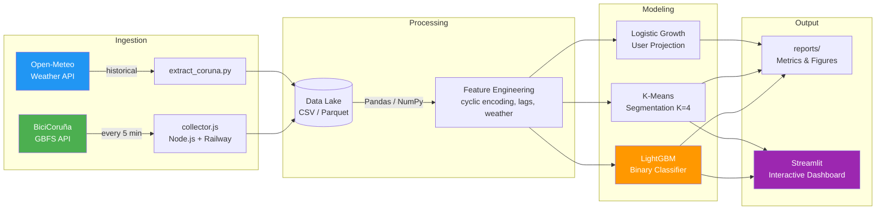
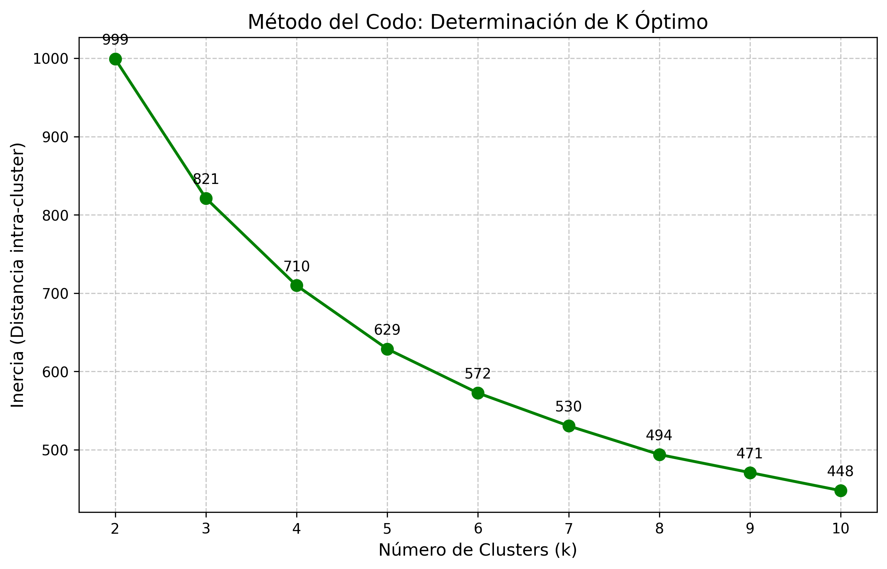
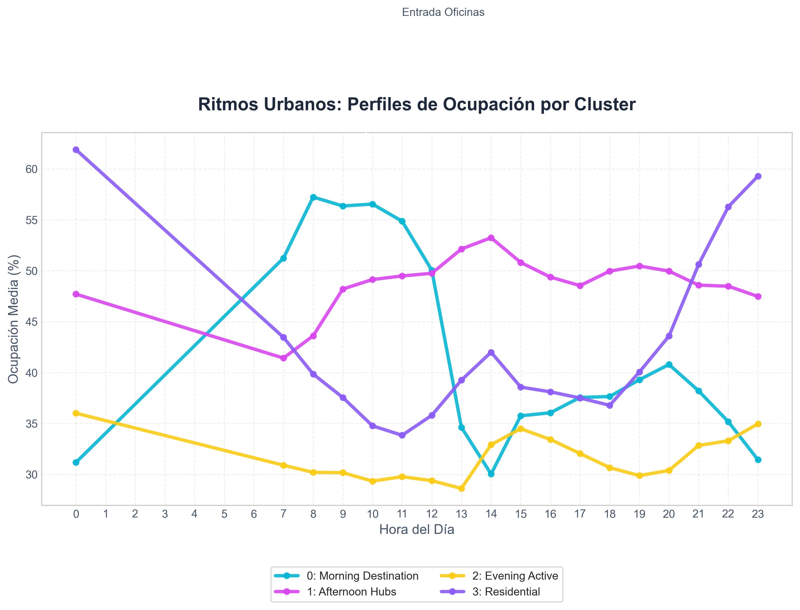
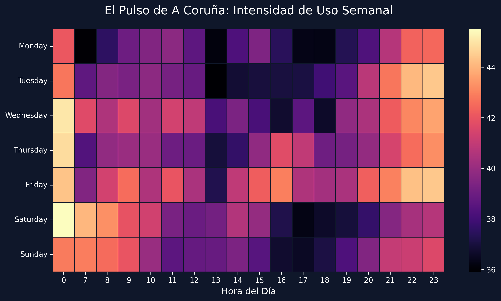
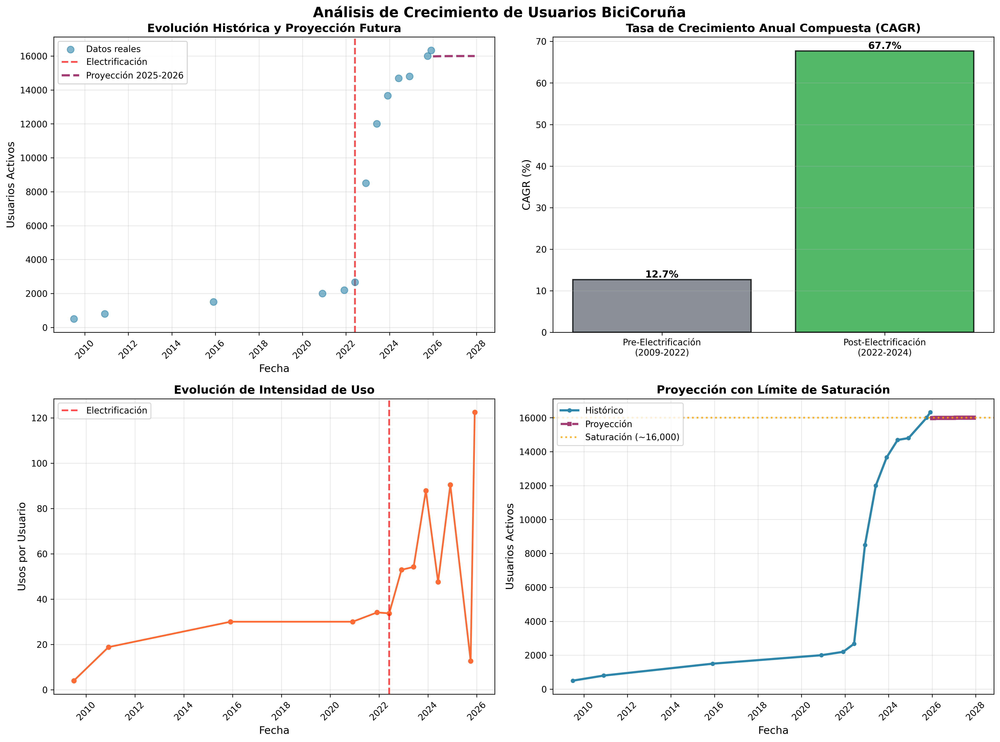
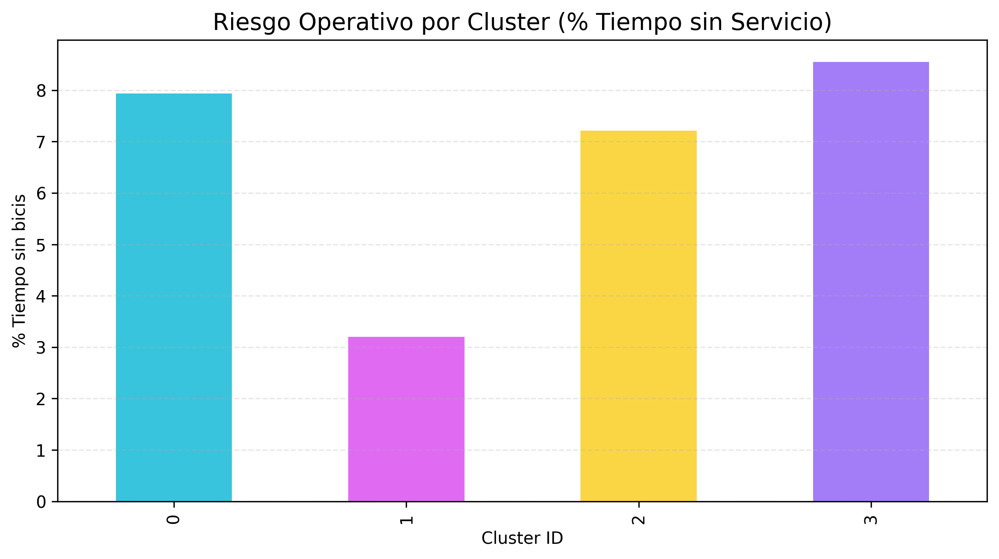
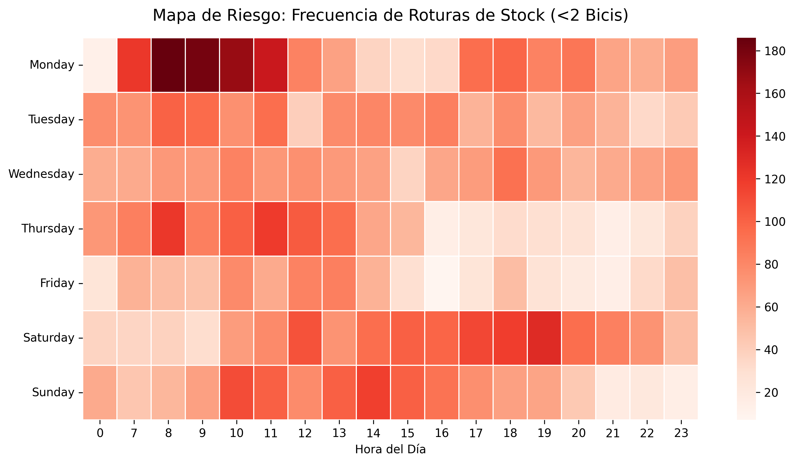
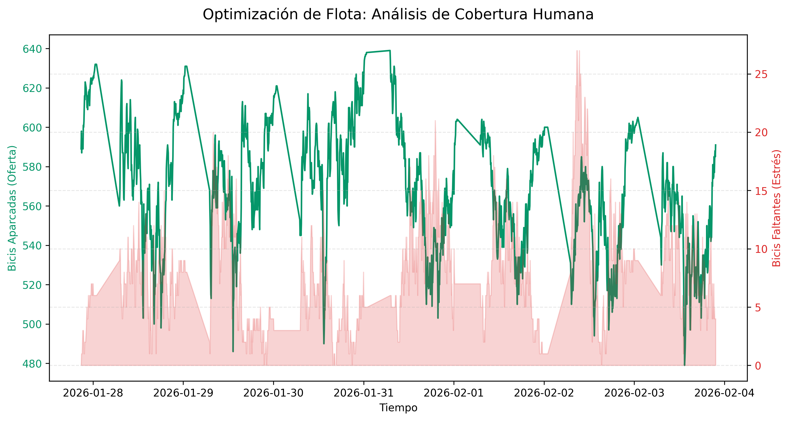

<div align="center">


[](README.md)
[](README_EN.md)

</div>

# BiciCoruña: Predictive Availability Analysis in Bike-Sharing Systems

> **Data engineering applied to shared mobility systems.**  
> A comprehensive "End-to-End" study that transforms raw data into business decisions: from real-time ingestion (ETL) to **stockout prediction** (LightGBM) and the design of **rebalancing strategies** based on clustering and operational risk analysis.

---

## Table of Contents
1. [Executive Summary](#1-executive-summary)
2. [Project Architecture](#2-project-architecture)
3. [Methodology and Experimentation](#3-methodology-and-experimentation)
4. [Results and Metrics](#4-results-and-metrics)
5. [Visual Analysis and Operational Insights](#5-visual-analysis-and-operational-insights)
6. [Business Insights and Operational Metrics](#6-business-insights-and-operational-metrics)
7. [Business Impact & ROI](#7-business-impact--roi)
8. [Study Conclusions](#8-study-conclusions)
9. [Tech Stack](#9-tech-stack)
10. [Data Sources](#10-data-sources)
11. [Reproducibility in 3 Steps](#11-reproducibility-in-3-steps-estimated-time-10-min)
12. [Roadmap](#12-roadmap)
13. [License](#13-license)
14. [Author](#14-author)

---

## 1. Executive Summary

This project addresses the challenge of **managing availability** in a network of **79 stations** and **670 bicycles** ([Source: Concello da Coruña](https://www.coruna.gal/bicicoruna/gl)). Unlike projects based on pre-existing public datasets, **the primary dataset was built from scratch**: a custom scraper (`collector.js`) was designed and deployed to monitor the GBFS API in real-time every 5 minutes, consolidating thousands of snapshots into a public historical time series that did not exist before. Through the analysis of this data, the following milestones have been achieved:

*   **Pattern Identification (K=4):** Mathematical segmentation of stations into 4 functional archetypes (Residential, Workplace, Leisure, Hybrid) validated via the elbow method.
*   **Effective Predictive Model:** Development of a **LightGBM** classifier capable of predicting availability within a **30-minute** horizon with an **F1-Score of 0.78** and **87% Accuracy**.
*   **Threshold Optimization:** Redefinition of the "empty station" concept (from 0 to <5 bikes) to improve operational sensitivity and prevent stockouts.

---

## 2. Project Architecture

The system follows a modular and reproducible data pipeline, from ingestion to visualization:



### 2.1 Key Features
| Layer | Component | Description |
|------|-----------|-------------|
| **Ingestion** | `collector.js` | Node.js scraper deployed on Railway, fault-tolerant with data gap handling. Captures every 5 min. |
| **Config** | `config.yaml` | Centralized configuration: thresholds, paths, hyperparameters. Single point of truth. |
| **Feature Eng.** | `prepare_data.py` | Cyclic encoding (hour, day), time lags, meteorological, and trend features. |
| **Modeling** | `classifier_final.py` | Transfer Learning (Barcelona → Coruña) + Fine-Tuning with early stopping. |
| **Evaluation** | `src/evaluation/` | Business analysis: ROI, operational risk, fleet optimization, user projection. |
| **Dashboard** | `app.py` + HTML | Streamlit + Leaflet.js with dark mode aesthetics for geospatial monitoring. |

### 2.2 Repository Structure
<details>
<summary><strong>View Full Directory Tree</strong></summary>

```text
bicicoruna-fleet-optimization/
├── assets/                  # Static resources (GIFs, images)
├── collector.js             # ETL: Real-time data scraper (Node.js)
├── config.yaml              # Global project configuration
├── package.json             # Node.js dependencies for collector
│
├── data/
│   ├── README.md            # Data documentation and reproducibility
│   ├── coruna/              # Raw telemetry data from BiciCoruña
│   ├── external/            # Auxiliary data (GeoJSON, demography)
│   └── processed/           # Light insights and key results
│
├── src/
│   ├── preprocessing/       # Cleaning and Feature Engineering
│   ├── models/              # LightGBM training and comparisons
│   ├── evaluation/          # Business metrics, ROI, and clustering
│   ├── visualization/       # Interactive maps and charts
│   └── utils/               # Config loader and time-based split
│
├── models/                  # Production model (classifier_final.txt)
├── dashboard/               # Streamlit app + Leaflet HTML maps
├── reports/
│   └── figures/             # Generated charts (PNG)
│
├── ANALYSIS_REPORT.md       # Detailed technical report
├── MODEL_CARD.md            # Model Card (Responsible ML)
├── SETUP.md                 # Collector deployment guide
├── requirements.txt         # Python dependencies
├── LICENSE                  # MIT License
└── README.md                # Main documentation
```
</details>

> **Note:** The primary telemetry dataset is included in the repository ([`data/coruna/tracking_data.csv`](data/coruna/tracking_data.csv)). See [`data/README.md`](data/README.md) for more details.

---

## 3. Methodology and Experimentation

A rigorous scientific approach was applied to validate hypotheses:

### 3.1 Scarcity Threshold Optimization (Threshold Tuning)
A critical challenge was defining "empty station" operationally.
*   **Experimental Design:** Multiple availability thresholds (from 0 to 10 bikes) were iteratively evaluated as target variables.
*   **Analyzed Trade-off:**
    *   *Low Threshold (0-2):* High precision but low recall (many false negatives, late alerts).
    *   *High Threshold (>7):* High recall but low precision (too many false alarms).
*   **Optimal Point:** The **< 5 bikes** threshold maximized the global F1-Score, providing the perfect balance between sensitivity and logistical reaction time (approx. 30 min before total depletion).

### 3.2 Transfer Learning (Experimental Validation)
*   **Hypothesis:** Does pre-training with 500k Bicing (Barcelona) records improve the model?
*   **Result:** The local Coruña model (**F1 0.783**) slightly outperformed the pre-trained one (**F1 0.782**).
    *   *Conclusion:* Transfer Learning introduced negative topographical biases (flat city vs. hilly city).
    *   *Value:* Architectural complexity was discarded in favor of a efficient local model.
    

---

## 4. Results and Metrics

Detailed quantitative results after experimentation and cross-validation phases.

### 4.1 Threshold Tuning Results
The impact of the alert threshold on prediction quality and utility was evaluated:

| Evaluated Threshold (< N Bikes) | Precision | Recall | F1-Score | Operational Impact |
| :--- | :---: | :---: | :---: | :--- |
| **Strict (0)** | **0.95** | 0.30 | 0.45 | **Negative:** Alerts only when already empty. |
| **Intermediate (2)** | 0.88 | 0.47 | 0.61 | **Low:** Little room for maneuver. |
| **Optimal (5)** | 0.82 | **0.75** | **0.78** | **Positive:** Ideal balance (30 min reaction). |
| **Lax (8)** | 0.60 | 0.85 | 0.70 | **Negative:** Excessive false alarms (noise). |

### 4.2 Model Evaluation
| Model | Training Strategy | F1-Score | Observations |
| :--- | :--- | :---: | :--- |
| **Baseline** | Historical average heuristic | 0.42 | Fails to capture demand peaks. |
| **Transfer Learning** | Barcelona pre-trained | 0.78 | No significant improvement. |
| **Local Model** | **Native LightGBM (Coruña)** | **0.78** | **Maximum performance; captures local pulse.** |

<details>
<summary><strong>View Model Hyperparameters (LightGBM)</strong></summary>

Final configuration for the `LGBMClassifier` model:
```json
{
    "objective": "binary",
    "metric": "binary_logloss",
    "boosting_type": "gbdt",
    "num_leaves": 31,
    "max_depth": 6,
    "learning_rate": 0.05,
    "feature_fraction": 0.8,
    "n_jobs": -1,
    "seed": 42,
    "is_unbalance": true
}
```
</details>

---

## 5. Visual Analysis and Operational Insights

Transforming raw data into actionable intelligence for decision-making.

### 5.1 Station Segmentation (K-Means Clustering)
Unsupervised learning was used to group stations by hourly behavior.

**5.1.1 Determining K (Elbow Method):**
Mathematical validation of the optimal number of clusters. Inertia stabilizes significantly at **K=4**.


**5.1.2 Resulting Hourly Profiles:**
The "commuting tide" of the city is clearly identified:
*   **Purple Line (Residential):** Empties drastically at 08:00 AM (trip origins, people leaving for work).
*   **Cyan Line (Destination/Work):** Fills up reciprocally at the same time (massive arrival at offices/campuses).


### 5.2 Time Cycles (Weekly Heatmap)
Time density analysis revealing city habits.


### 5.3 Weather Impact (Exogenous Factors)
Usage data correlated with local weather variables (`src/evaluation/analisis_clima.py`):
*   **Rain:** Precipitation > 0.1mm reduces demand by **-22.2%**.
*   **Wind:** Surprisingly, gusts > 20km/h did not reduce use (+6%), suggesting e-bike user resilience.
*   **Temperature:** Moderate positive correlation (**r=0.20**); every degree counts.

---

## 6. Business Insights and Operational Metrics

Analysis of key KPIs to evaluate system performance and social impact:

### 6.1 Environmental Impact ([Official Data 2025](https://www.coruna.gal/bicicoruna/gl))
Based on service statistics: **16,462 active users**, **1,728,835 uses in 2025**, **5,124,239 km traveled**.
> **76.2 Tons of CO2 saved per month.**
> 
> *   **Local Equivalence:** This saving is equivalent to removing **4,320 daily car trips** from Avenida Alfonso Molina (7.8% of its average traffic).
> *   **Visual Impact:** Equivalent to removing an uninterrupted convoy of **200 cars** (almost 1 km of traffic jam) every month.

### 6.2 System Resilience (Service Level)
Despite detected bottlenecks, network resilience is high:
*   **Global Availability:** **97.2%** (Users find a bike 97% of the time).
*   **Failure Concentration:** The **2.8%** unavailability is concentrated in 5 critical nodes, validating a focused rebalancing strategy (Pareto Principle).

### 6.3 Commuting Flow Dynamics
The network exhibits a cyclic biological behavior:
*   **Centripetal Flow (07:00 - 09:00):** Massive movement from residential areas towards work and university zones.
*   **Centrifugal Flow (14:00 - 16:00):** Return dispersion towards the outskirts.


### 6.4 Future Prediction: Saturation and Expansion
The logistical model predicts that, with the current network, **BiciCoruña will reach a ceiling at ~17,000 users**.


---

## 7. Business Impact & ROI
Transforming predictions into euros and strategic decisions (`src/evaluation/impacto_negocio.py`):

### 7.1 Risk Quantification (Jan '26 Calibrated Data)
The system loses **721 service hours** per week due to critical bike shortages (Operational stockouts < 2 units).
*   **Estimated Cost (Churn Risk):** Assuming a conservative churn risk (2%) and annual fee (€40):
    > **€102,000 Annual User Retention Risk.**

### 7.2 Risk Scorecard by Archetype
The **Cluster 3 (Residential, purple bar)** collapses due to morning emptying, and **Cluster 0 (Destination, blue bar)** due to return inefficiency, totaling an operational risk of ~8-9%.



### 7.3 Operational Risk Map
Precisely identified when and where the system physically collapses.



### 7.4 Spatial Identification (Geography of Failure)
The "epicenter" of shortages: western residential neighborhoods.


### 7.5 Fleet Optimization (Stress Analysis)
Calculating the capacity needed to eliminate service failures based on real demand peaks.



*   **Diagnosis:** The real deficit peak occurs on **Mondays at 08:42 AM** and reaches **27 units**.
*   **Recommendation:** Selective fleet expansion of **27 units (+4.2%)** to reach a total fleet of **666 bikes**.

### 7.6 Critical Infrastructure Diagnosis (Top Offenders)
| Critical Station | % Time Without Service | Operational Impact |
| :--- | :---: | :--- |
| **Agra do Orzán** | **16.1%** | 1 out of every 6 min without service. |
| **Gaiteira** | **11.7%** | Commercial bottleneck. |
| **Marineda City** | **10.7%** | Labor commuting demand. |
| **Santa Margarita** | **10.5%** | Structural dock deficit. |
| **Rosales III** | **10.4%** | Educational coverage failure. |

---

## 8. Study Conclusions

1.  **Viable Technology:** A well-optimized **local LightGBM model** outperforms generalist approaches, predicting availability at **30 minutes** with high reliability (**F1 0.78**).
2.  **Efficiency vs. Coverage:** The system is robust but suffers from structural inequality. The center works; outskirts (Agra do Orzán) bear the cost of service failure.
3.  **Real Sustainability:** BiciCoruña saves **76 Tons CO2/month**, validating its social return.

---

## 9. Tech Stack
| Layer | Technologies | Description |
|------|-------------|-------------|
| **Core ML** | `LightGBM`, `Scikit-Learn` | Gradient Boosting and Clustering algorithms. |
| **Data Processing** | `Pandas`, `NumPy` | Vectorized manipulation of time series. |
| **Infrastructure** | `Node.js`, `Railway` | 24/7 scraping scripts and cloud deployment. |
| **Visualization** | `Matplotlib`, `Leaflet` | Static charts and interactive web maps. |

---

## 10. Data Sources
1.  **GBFS Protocol:** real-time station status and information.
2.  **Official Website:** [BiciCoruña (Concello da Coruña)](https://www.coruna.gal/bicicoruna/gl).

---

## 11. Reproducibility in 3 Steps (Estimated time: < 10 min)

### 11.1 Step 1: Environment Setup
```bash
git clone https://github.com/nathanmarinas2/bicicoruna-fleet-optimization.git
cd bicicoruna-fleet-optimization
pip install -r requirements.txt
```

### 11.2 Step 2: Data Ready
The primary dataset is already included in `data/coruna/tracking_data.csv`.

### 11.3 Step 3: Run "End-to-End" Pipeline
```bash
# 1. Train final classifier
python src/models/classifier_final.py

# 2. Generate business analysis and visualizations
python src/evaluation/analisis_bicicoruna.py
python src/evaluation/analisis_codo.py
python src/evaluation/optimizacion_flota.py

# 3. (Optional) Launch interactive dashboard
streamlit run dashboard/app.py
```

---

## 12. Roadmap
- **REST API:** FastAPI deployment for real-time inference.
- **Dockerization:** Packaging for Kubernetes deployment.
- **Multimodal Integration:** Bus data cross-referencing.

---

## 13. License
This project is under the **MIT** License.

---

## 14. Author

**Nathan Mariñas Pose**  
[LinkedIn](https://www.linkedin.com/in/nathan-marinas-pose/) • [GitHub](https://github.com/nathanmarinas2)

---
*Project developed for academic and research purposes in sustainable mobility.*
